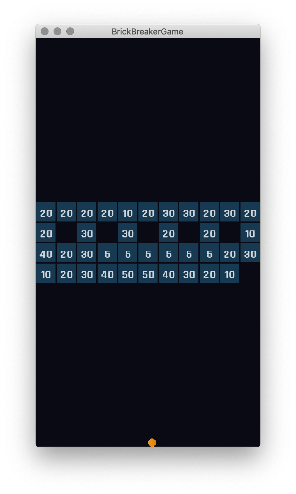
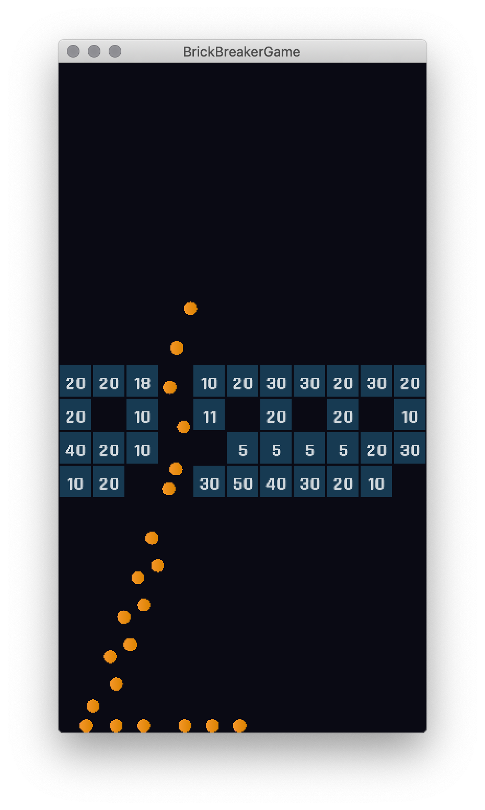
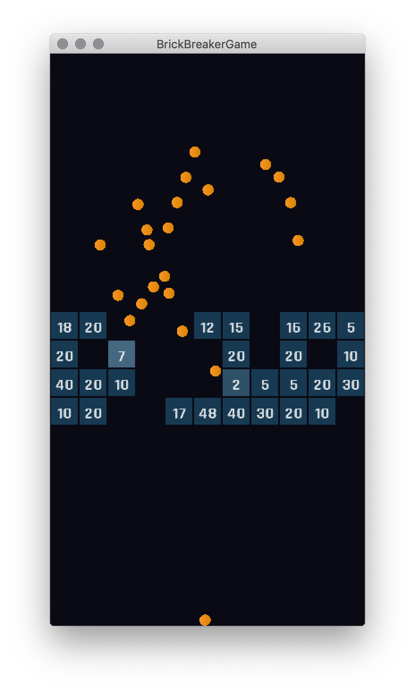

# Brick-Breaker-Game
This is a clone (proof of concept) project of a popular app called "Bricks Breaker".
 The LibGDX Framework was used for cross-platform compatibility.

# General
All the code can be found within the <b>core/src</b> folder.

# Gameplay
The gameplay is fairly simple. You have a given amount of balls, which you have to use to shoot the blocks. Each block has a limited "life". Every hit subtracts one life. As soon as all your balls fall back to the ground, the blocks will move one row downwards. When the first block touches the ground the game is lost. If you destroy all the blocks, then the game is won and you move on to the next level.

  
  

 

